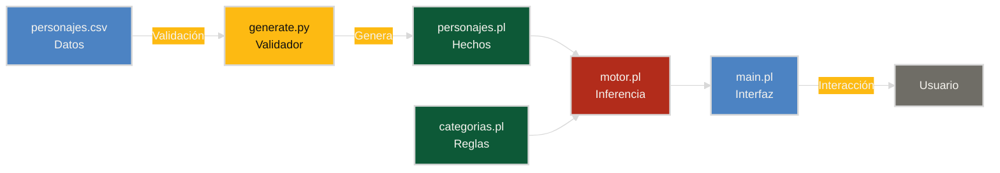

# Akinator Disney

Sistema Experto en Prolog

<div class="pt-12">
  <span @click="$slidev.nav.next" class="px-2 py-1 rounded cursor-pointer" hover="bg-white bg-opacity-10">
    Presiona Espacio para continuar <carbon:arrow-right class="inline"/>
  </span>
</div>

---
layout: center
---

# Descripción

<v-click>

- El usuario piensa en un personaje Disney
- El sistema hace preguntas de sí/no
- Adivina el personaje en <v-mark color="violet">aproximadamente 8 preguntas</v-mark>
- <v-mark color="violet">100% de precisión</v-mark> con 120 personajes

</v-click>

---

# Arquitectura

Separación entre datos y lógica de inferencia

<v-click>

- **CSV** contiene los datos
- **Python** valida y genera
- **Prolog** ejecuta la inferencia
- **Usuario** interactúa con el sistema

</v-click>

<v-click>



</v-click>

---

# Base de Conocimiento

<v-click>

- <v-mark color="violet">120 personajes</v-mark> Disney
- <v-mark color="violet">13 atributos</v-mark> discriminantes
- Desde clásicos hasta contemporáneos

</v-click>

<v-click>

<div class="mt-8">

| Atributo | Valores posibles |
|----------|------------------|
| especie | humano, animal, objeto, ser_magico, juguete, sirena, monstruo |
| vive_en | castillo, bosque, selva, mar, ciudad, desierto, sabana, oceano |
| color_pelo | negro, rubio, rojo, cafe, blanco, morado, naranja, gris, azul |
| habla | si, no |
| edad | adulto, nino, bebe, adolescente, anciano |

</div>

</v-click>

---

# Flujo de Datos

<v-click>

**personajes.csv**
- Fuente de verdad del sistema
- Un personaje por fila
- Editable con herramientas estándar

**generate.py**
- Valida campos obligatorios
- Verifica valores permitidos
- Detecta duplicados

**personajes.pl**
- Generado automáticamente
- Contiene hechos Prolog
- No se edita manualmente

</v-click>

---
layout: two-cols
---

# Motor de Inferencia

Estrategia basada en <v-mark color="violet">entropía de información</v-mark>

<v-click>

- Selecciona el atributo con más valores distintos
- Pregunta por el valor más frecuente
- <v-mark color="violet">Maximiza la eliminación</v-mark> de candidatos

</v-click>

::right::

<v-click>

```prolog
mejor_atributo(Candidatos, Mejor) :-
    findall(
        Score-Attr,
        (
            atributo(Attr),
            \+ (member(P, Candidatos), 
                atributo(P, Attr, null)),
            score(Attr, Candidatos, Score)
        ),
        Pares
    ),
    max_member(_-Mejor, Pares).
```

</v-click>

---

# Ejemplo de Entropía

<v-click>

Escenario con 60 candidatos restantes

**Pregunta efectiva**
- "¿Vive en ciudad?"
- Resultado: 30 sí, 30 no
- Elimina <v-mark color="violet">aproximadamente 50%</v-mark>

**Pregunta inefectiva**
- "¿Es Mickey Mouse?"
- Resultado: 1 sí, 59 no
- Elimina <v-mark color="violet">solo 1 candidato</v-mark>

El motor siempre selecciona la pregunta más discriminante

</v-click>

---

# Manejo de Atributos Opcionales

<v-click>

**Problema**

No todos los personajes requieren todos los atributos. Mickey tiene ropa pero Rex (juguete) no.

**Solución**

El motor ignora atributos donde algún candidato tiene valor `null`

```prolog
\+ (member(P, Candidatos), atributo(P, Attr, null))
```

**Resultado**

Solo pregunta por un atributo cuando todos los candidatos actuales tienen valor definido

</v-click>

---

# Construcción de Preguntas

<v-click>

**Plantillas con interpolación**

```prolog
plantilla_pregunta(vive_en, "¿Tu personaje vive en {valor}?").
```

**Casos especiales para valores na**

```prolog
plantilla_na(color_vestimenta, "¿Tu personaje no usa ropa?").
```

**Ejemplos de salida**
- `vive_en = bosque` genera "¿Tu personaje vive en bosque?"
- `color_vestimenta = na` genera "¿Tu personaje no usa ropa?"

</v-click>

---
layout: two-cols
---

# Testing Automático

<v-click>

- Simula el juego para cada personaje
- Usa el mismo motor de producción
- Reporta precisión y eficiencia

</v-click>

::right::

<v-click>

```bash
$ swipl -g "test_todos, halt" test.pl

============================================
RESULTADO: 120/120 encontrados correctamente
Preguntas - promedio: 7.7  max: 12  min: 5
============================================

Personaje                OK    Preguntas
--------------------------------------------
mickey_mouse             ✓     6
simba                    ✓     9
elsa                     ✓     8
...
```

</v-click>

---

# Detalle de Testing

```bash
$ swipl -g "test_detalle(bullseye), halt" test.pl

Personaje: bullseye
Resultado: ✓ encontrado
Preguntas (12):
  [si] ¿Tu personaje vive en ciudad?
  [no] ¿Tu personaje no usa ropa?
  [no] ¿Tu personaje viste de rojo?
  [no] ¿Tu personaje viste de blanco?
  [no] ¿Tu personaje viste de azul?
  [no] ¿Tu personaje es humano?
  [no] ¿Tu personaje es animal?
  [si] ¿Tu personaje habla?
  ...
```

<v-click>

Muestra el trace completo del proceso de inferencia

</v-click>

---

# Validación de Datos

<v-click>

**generate.py valida antes de generar Prolog**

```python
VALID = {
    "especie": {"humano", "animal", "objeto", ...},
    "vive_en": {"castillo", "bosque", "selva", ...},
    ...
}
```

**Errores detectados**
- Campos vacíos
- Valores no permitidos
- Personajes duplicados

**Resultado**

<v-mark color="violet">Imposible generar</v-mark> una base de conocimiento inconsistente

</v-click>

---

# Escalabilidad

<v-click>

**Agregar un personaje**
1. Editar `personajes.csv` (una línea)
2. Ejecutar `python generate.py`
3. Verificar con tests

**Agregar un atributo**
1. Agregar columna en `personajes.csv`
2. Definir valores válidos en `categorias.pl`
3. Actualizar validación en `generate.py`
4. Ejecutar `python generate.py`

**Generalidad**

El sistema no está acoplado al dominio Disney. Puede adaptarse a otros dominios cambiando solo los datos.

</v-click>

---
layout: center
---

# Resultados

<v-click>

- <v-mark color="violet">100% de precisión</v-mark> en 120 personajes
- <v-mark color="violet">7.7 preguntas</v-mark> en promedio
- Mínimo de 5 preguntas
- Máximo de 12 preguntas
- Testing automático garantiza corrección
- Documentación completa en README

</v-click>

---

# Conclusiones

<v-click>

**Separación de responsabilidades**

La separación entre datos (CSV) y lógica (Prolog) facilita el mantenimiento

**Validación temprana**

Los errores se detectan antes de la ejecución

**Testing automático**

120 tests ejecutados en segundos dan confianza en el sistema

**Prolog para inferencia**

El código declarativo es conciso y expresivo para este tipo de problemas

**Diseño escalable**

Agregar personajes o atributos requiere cambios mínimos

</v-click>

---
layout: center
class: text-center
---

# Demostración

Ejecución en terminal

<div class="pt-12 text-sm opacity-50">
Presiona ESC para salir de la presentación
</div>

---
layout: center
class: text-center
---

# Preguntas

<div class="pt-12">
  <a href="https://github.com/DEmmaRL/Prolog-Akinator" target="_blank" class="text-xl">
    github.com/DEmmaRL/Prolog-Akinator
  </a>
</div>
